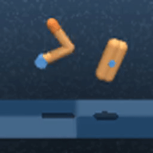
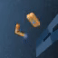
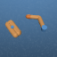
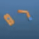

# Imitation from Observation

This project aims to train an agent to imitate an expert performing a task and observed through a video.
The first step is to train an agent using a Deep RL algorithm. 

We use the algorithm [DrQv2](https://arxiv.org/abs/2107.09645) to train the expert in a continuous control domain of [DM Control](https://github.com/deepmind/dm_control),
which allow us to build a dataset of video that is used to train an imitator agent with [Imitation from Observation](https://arxiv.org/abs/1707.03374) algorithm.

<p align="center">

<br>
Expert training in DM Control's Finger domain
</p>

With this dataset, we train a context translator which imagines next frames in a viewpoint based on a first frame in this viewpoint and observations of frames from another viewpoint.
<p align="center">




<br>
(1) Source video. (2) Target video first frame. (3) Predicted target video. (4) Target video.
</p>


## Setup

* Install the environment
```shell
conda env create -f env.yml
conda activate sharingan
```

* Train the expert (Optional, a trained expert is provided in `experts/finger_span.pt` )
```shell
python train.py
```

* Generate videos of expert acting in the environment
```shell
python generate_finger_span_expert_video.py
```
The data are stored in `videos/finger`

* Train the context translator
```shell
python train_ct.py
```

* Watch training in Tensorboard
```shell
tensorboard --logdir exp_local
```

## Acknowledgements
This code is inspired by
* Denis Yarats's [DrQv2 project](https://github.com/facebookresearch/drqv2)

## References
* [Mastering Visual Continuous Control: Improved Data-Augmented Reinforcement Learning](https://arxiv.org/pdf/2107.09645.pdf)
* [Imitation from Observation: Learning to Imitate Behaviors from Raw Video via Context Translation](https://arxiv.org/pdf/1707.03374.pdf)
