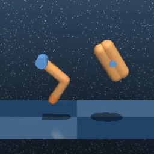
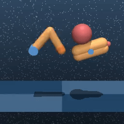
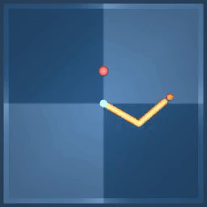
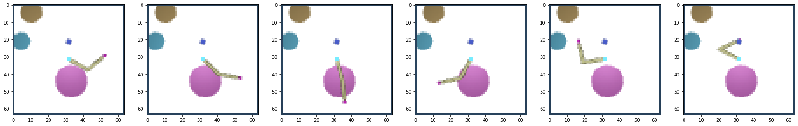
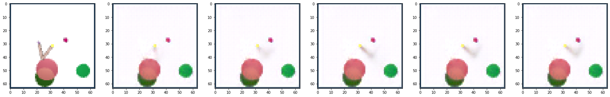

# Imitation from Observation
This project implement an imitation from observation algorithm.
The algorithm trains an agent to learn to imitate an expert performing some tasks, by using videos of this expert.

We evaluate this algorithm on [DeepMind Control](https://github.com/deepmind/dm_control) tasks by training different experts 
and trying to imitate these experts. To evaluate our model:
* We train an expert on a specific task:

We use [DrQv2](https://arxiv.org/abs/2107.09645) algorithm, a model-free RL algorithm, to train an expert on a [DeepMind Control](https://github.com/deepmind/dm_control) task.
This expert allows us to build a dataset of demonstrations showing how to do the task in many source contexts.

<p align="center">



<br>
Demo of experts trained on Finger Spin, Finger Turn and Reacher tasks
</p>

* We train a context translation model using videos of the trained expert

The Context translation model which takes as input a demonstration of an expert in a source context, the first observation of the imitator agent in the target context, and outputs a predicted sequence of next observations in this target context.
We train this model with this [Imitation from Observation](https://arxiv.org/pdf/1707.03374.pdf) algorithm.
<p align="center">

<br>

Example of context translation from a source context into a target context. The first row is the sequence of expert observations, the second row is the predicted sequence of agent observation. 
</p>

* We train an imitator agent to reproduce the different states predicted by the context translator using a classic Actor-Critic algorithm. 


## Usage

* Install the environment
```shell
conda env create -f env.yml
conda activate ifo
```


For the following we consider only the task Reacher Hard, but this process can be applied with any other tasks.

### Expert Training (this part is optional, trained experts are provided in `experts` folder )
* Train the expert
```shell
python train.py task=reacher_hard
```
* Watch evaluation videos in the `eval` folder of the experiment folder
* Watch the training on Tensorboard
```shell
tensorboard --logdir exp_local
```
* Copy-paste the `snapshot.pt` file from the experiment folder `exp_local` into the `experts` folder (create it in the root if it doesn't exist) and name it `reacher_hard.pt`

### Context translation model training

* Generate demonstrations of the expert acting in many random contexts
```shell
python generate_reacher_hard_expert_video.py
```
The demonstration dataset is stored in `videos/reacher_hard` and split into `train` and `valid` datasets.

* Train the context translation model on the Reacher Hard expert videos
```shell
python train_ct.py task=reacher_hard
```
* Watch evaluation videos in the `eval` folder of the experiment folder
* Watch the training on Tensorboard
```shell
tensorboard --logdir ct_local
```

* Copy-paste the `snapshot.pt` file from the experiment folder `ct_exp_local` into the `ct` folder (create it in the root if it doesn't exist) and name it `reacher_hard.pt` 

### Imitator Agent Training
* Train the imitator agent by using the expert as demonstration video provider and the context translation model as context translator
```shell
python train_ac.py task=reacher_hard
```
* Watch evaluation videos in the `eval` folder of the experiment folder
* Watch the training on Tensorboard
```shell
tensorboard --logdir ac_local
```

## Acknowledgements
* We reuse Denis Yarats's code of the [DrQv2 project](https://github.com/facebookresearch/drqv2) for this project

## References
* [Mastering Visual Continuous Control: Improved Data-Augmented Reinforcement Learning](https://arxiv.org/pdf/2107.09645.pdf)
* [Imitation from Observation: Learning to Imitate Behaviors from Raw Video via Context Translation](https://arxiv.org/pdf/1707.03374.pdf)
